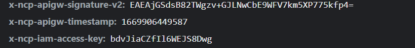

# :pushpin: 가까? 마까?
>제주도 맛집 추천 플랫폼  
>https://www.gaggamagga.shop

### [팀 Github](https://github.com/1TEAM12/GaGgaMaGga_BE)  

 

## 1. 제작 기간 & 참여 인원 & 맡은 역할
- 2022년 12월 1일 ~ 12월 29일
- 팀 프로젝트 (팀장)

맡은 역할

- 유저관리, 프로필, 개인설정 및 추가기능
- User 테스트 코드
- Docker, AWS 배포
- CI/CD 구축
- 코드 리팩토링 / Swagger 적용
- 맡은 기능 프론트 연동

 

## 2. 사용 기술
#### `Back-end`
  - Python 3.10.8
  - Django 4.1.3
  - DRF 3.14.0
  - Django simple JWT 5.2.2
  - Django Channel 4.0.0
  - Celery 5.2.7
#### `Database`
  - PostgreSQL 14.5
#### `Infra`
  - AWS EC2
  - AWS Route 53
  - AWS CloudFront
  - AWS S3
  - Docker 20.10.12
  - Docker Compose 2.11.2
  - Gunicorn
  - Nginx 1.23.2
  - Daphne
  - Redis 7.0.7
  - Rabbit MQ 3.11
  - Github Action
#### `Front-end`
  - Vanilla JS
  - Element UI
#### `Management`
  - Notion
  - Github
  - Slack

 

## 3. 핵심 기능
- 사용자 환경(회원가입, 로그인, 회원정보 관리, 팔로우, 비활성화, 아이디/비밀번호 찾기 등등)
- 맛집 후기(리뷰) 작성/수정/삭제, 조회수 카운트, 좋아요, 검색 기능
- 후기 댓글 작성/수정/삭제
- 후기 댓글의 대댓글 작성/수정/삭제 기능
- 유저간 댓글 알림 기능

 

## 4. [ERD 설계](https://www.erdcloud.com/d/RvXb4PCLq3t3CPb3e)

 

## 5. API 설계 | [Swagger API Docs](https://www.back-gaggamagga.shop)

<b>USER API</b>

<b>PLACE API</b>

<b>REVIEW API</b>
 

<b>NOTIFICATION API</b>

 

## 6. Architecture

 

## 7. Test Case

USER TEST CODE

## 회원가입
1. 회원가입 성공
2. 회원가입 실패(이메일 빈칸)
3. 회원가입 실패(이메일 형식)
4. 회원가입 실패(이메일 중복)
5. 회원가입 실패(아이디 빈칸)
6. 회원가입 실패(아이디 유효성검사)
7. 회원가입 실패(아이디 중복)
8. 회원가입 실패(비밀번호 빈칸)
9. 회원가입 실패(전화번호 중복)
10. 회원가입 실패(비밀번호확인 빈칸)
11. 회원가입 실패(비밀번호, 비밀번호 확인 일치 )
12. 회원가입 실패(비밀번호 유효성 검사(simple))
13. 회원가입 실패(비밀번호 유효성검사(동일))
14. 회원가입 실패(약관동의)

## 회원정보 수정/비활성화
15. 회원정보 수정 성공
16. 회원정보 수정 실패(이메일 빈칸)
17. 회원정보 수정 실패(이메일 중복)
18. 회원정보 수정 실패(이메일 형식)
19. 회원정보 수정 실패(휴대폰번호 중복)
20. 회원 비활성화 

## 로그인
21. (access token)로그인 성공
22. (access token)로그인 실패
23. (access token 여러번 시도)로그인 실패
24. (refresh_token)로그인 성공
25. (refresh_token)로그인 실패(refresh 입력안했을 때)
26. (refresh_token)로그인 실패(access 토큰 넣었을 때)

## 로그아웃
27. (refresh_token)로그아웃 성공
28. (refresh_token)로그아웃 실패(refresh 입력안했을 때)
29. (refresh_token)로그아웃 실패(access 토큰 넣었을 때)
30. 일괄 로그아웃 성공

## 토큰 유효 확인
31. access 토큰 유효 (성공)
32. refresh 토큰 유효 (성공)
33. 토큰 유효하지 않음 (실패)

## 이메일 인증 확인
34. 이메일 인증 확인 성공
35. 이메일 인증 확인 실패

## 이메일 재인증
36. 이메일 재인증 성공
37. 이메일 재인증 실패

## 아이디 찾기(인증번호)
38. 인증번호 보내기 성공
39. 인증번호 보내기 실패
40. 인증번호 확인 성공
41. 인증번호 확인 실패

## 프로필
42. 개인 프로필 조회
43. 개인 프로필 수정 성공
44. 개인 프로필 수정 실패(닉네임 유효성검사)
45. 개인 프로필 수정 실패(닉네임 중복)
46. 공개 프로필 조회
47. 로그인 기록
48. IP 국가코드 차단 읽기 성공
49. IP 국가코드 차단 성공
50. IP 국가코드 차단 실패 (국가 코드 중복)
51. IP 국가코드 차단 실패 (국가 코드 빈칸)
52. IP 국가코드 차단 삭제

## 비밀번호 변경
53. 비밀번호 변경 성공
54. 비밀번호 변경 실패(현재 비밀번호 빈칸)
55. 비밀번호 변경 실패(현재 비밀번호 불일치)
56. 비밀번호 변경 실패(비밀번호 빈칸)
57. 비밀번호 변경 실패(비밀번호 확인 빈칸)
58. 비밀번호 변경 실패(비밀번호 현재비밀번호와 동일시)
59. 비밀번호 변경 실패(비밀번호 유효성검사(simple))
60. 비밀번호 변경 실패(비밀번호 유효성검사(동일))
61. 비밀번호 변경 실패(비밀번호, 비밀번호 확인 일치)

## 비밀번호 찾기
62. 비밀번호 찾기 실패(존재하지 않는 이메일전송)
63. 비밀번호 찾기 실패(형식에 맞지 않는 이메일 전송)
64. 비밀번호 찾기 실패(이메일 빈칸일 때 이메일 전송)

## 비밀번호 토큰 인증
65. 비밀번호 토큰 인증 성공
66. 비밀번호 토큰 인증 실패
## 비밀번호 분실시 재설정
67. 비밀번호 분실시 재설정 성공
68. 비밀번호 분실시 재설정 실패(비밀번호 빈칸)
69. 비밀번호 분실시 재설정 실패(비밀번호 확인 빈칸)
70. 비밀번호 분실시 재설정 실패(비밀번호 유효성검사(simple))
71. 비밀번호 분실시 재설정 실패(비밀번호 유효성검사(동일))
72. 비밀번호 분실시 재설정 실패(비밀번호, 비밀번호 확인 일치)
73. 토큰이 다를 경우

## 비밀번호 만료
74. 비밀번호 만료시 확인
75. 비밀번호 만료시 다음에 변경
76. 비밀번호 만료시 변경 성공
77. 비밀번호 만료시 변경 실패(현재 비밀번호 빈칸)
78. 비밀번호 만료시 변경 실패(현재 비밀번호 불일치)
79. 비밀번호 만료시 변경 실패(비밀번호 빈칸)
80. 비밀번호 만료시 변경 실패(비밀번호 확인 빈칸)
81. 비밀번호 만료시 변경 실패(비밀번호 유효성검사(simple))
82. 비밀번호 만료시 변경 실패(비밀번호 유효성검사(동일))
83. 비밀번호 만료시 변경 실패(비밀번호, 비밀번호 확인 일치)

## 팔로우 성공
84. 팔로우 기능 성공
85. 팔로우 기능 실패(본인 팔로우 했을 때)

PLACE TEST CODE

## 맛집 카테고리 선택
1. 카테고리 선택(음식 선택 - 비로그인 계정)
2. 카테고리 선택(장소 선택 - 비로그인 계정)

## 맛집 리스트 추천
3. 맛집 리스트 불러오기(음식 선택 - 비로그인 계정)
4. 맛집 리스트 불러오기(장소 선택 - 비로그인 계정)
5. 맛집 리스트 불러오기(음식 선택 - 로그인 계정)
6. 맛집 리스트 불러오기(장소 선택 - 로그인 계정)

## 맛집 상세페이지
7. 맛집 상세페이지 조회
8. 맛집 삭제(관리자 계정)
9. 맛집 삭제 실패(비관리자 계정)
10. 맛집 북마크(유저일 때)
11. 맛집 검색

REVIEW TEST CODE

## 비로그인 계정, 로그인 계정(리뷰X), 카카오계정(리뷰X)
1. 리뷰 전체 조회(Best리뷰)
2. 맛집 리뷰 조회

## 리뷰 작성
3. 리뷰 작성(이미지X)
4. 리뷰 작성(이미지O)
5. 리뷰 작성 실패(비로그인 유저)
6. 리뷰 작성 실패(리뷰 내용이 빈칸)
7. 리뷰 작성 실패(리뷰 평점이 빈칸)

## 리뷰 수정
8. 리뷰 수정 내용 조회
9. 리뷰 수정(이미지X)
10. 리뷰 수정(이미지O)
11. 리뷰 수정 실패(비로그인 유저)
12. 리뷰 수정 실패(리뷰 내용이 빈칸)
13. 리뷰 수정 실패(리뷰 평점이 빈칸)
14. 리뷰 수정 실패(리뷰 작성자 불일치(작성자 user1))

## 리뷰 삭제
15. 리뷰 삭제 실패(비로그인 유저)
16. 리뷰 삭제 실패(리뷰 작성자 불일치(작성자 user1))

## 리뷰 신고
17. 리뷰 신고 
18. 리뷰 신고 실패(비로그인 유저)
19. 리뷰 신고 실패(작성자가 신고)
20. 리뷰 신고 실패(중복 데이터)
21. 리뷰 신고 실패(신고 내용 빈칸)
22. 리뷰 신고 실패(신고 카테고리 빈칸)

## 리뷰 좋아요
23. 리뷰 좋아요
24. 리뷰 좋아요 실패(비로그인 유저)

## 댓글 조회/작성
25. 해당 리뷰의 댓글 조회 성공
26. 댓글 작성 성공
27. 로그인 안된 유저가 시도했을때 에러나오는지
28. 댓글 작성 실패(댓글 내용이 빈칸)

## 댓글 수정
29. 댓글 수정 성공
30. 댓글 수정 실패(비로그인 유저)
31. 댓글 수정 실패(댓글 수정 내용이 빈칸)
32. 댓글 수정 실패(리뷰 작성자 불일치(작성자 user1))

## 댓글 삭제
33. 댓글 삭제
34. 댓글 삭제 실패(비로그인 유저)
35. 댓글 삭제 실패(댓글 작성자(user1)와 삭제 유저(user2)불일치)

## 댓글 신고
36. 댓글 신고 
37. 댓글 신고 실패(비로그인 계정)
38. 댓글 신고 실패(작성자가 신고)
39. 댓글 신고 실패(중복 데이터)
40. 댓글 신고 실패(신고 내용 빈칸)
41. 댓글 신고 실패(신고 카테고리 빈칸)

## 댓글 좋아요
42. 댓글 좋아요
43. 댓글 좋아요 실패(비로그인 계정)

## 대댓글 조회/작성
44. 해당 댓글의 대댓글 조회 성공
45. 대댓글 작성 성공
46. 로그인 안된 유저가 시도했을때 에러나오는지
47. 대댓글 작성 실패(대댓글 내용이 빈칸)

## 대댓글 수정
48. 대댓글 수정
49. 대댓글 수정 실패(비로그인 유저)
50. 대댓글 수정 실패(댓글 수정내용이 빈칸)
51. 대댓글 수정 실패(리뷰 작성자 불일치(작성자 user1))

## 대댓글 삭제
52. 대댓글 삭제
53. 대댓글 삭제 실패(비로그인 유저)
54. 대댓글 삭제 실패(대댓글작성자(user1)와 삭제유저(user2)불일치)

## 대댓글 신고
55. 대댓글 신고
56. 대댓글 신고 실패(비로그인 유저)
57. 대댓글 신고 실패(작성자가 신고)
58. 대댓글 신고 실패(중복 데이터)
59. 대댓글 신고 실패(신고 내용 빈칸)
60. 대댓글 신고 실패(신고 카테고리 빈칸)

## 대댓글 좋아요
61. 대댓글 좋아요
62. 대댓글 좋아요 실패(비로그인 유저)

NOTIFICATION TEST CODE

## 알람 기능
1. 알람 리스트 조회
2. 알람 읽음 처리

 

## 8. 핵심 트러블 슈팅
### 8.1. Email 전송 속도 향상(비동기 처리)
[상세설명](https://bolder-starburst-a73.notion.site/Email-0bfc032023d345eabfe3818fc87ac98c)
- 문제: 인증 이메일 전송 속도가 느림
- 문제의 원인: 이메일 전송은 동기로 처리하기에 요청을 보내고 응답을 받을 때까지 기다림

<b>기존 코드</b>

~~~python
def send_email(message):
    email = EmailMessage(subject=message["email_subject"], body=message["email_body"], to=[message["to_email"]])
    email.send()
~~~

- 해결: 메시지 브로커 Rabbit MQ 와 Celery 활용으로 이메일 전송 비동기 처리 4.3s -> 4 ms 개선 

<b>개선된 코드</b>

~~~python
# users/utils.py
message = {
          "email_body": email_body,
          "to_email": user.email,
          "email_subject": "이메일 인증",
       }
send_email.delay(message)

# users/task.py
from __future__ import absolute_import, unicode_literals

from celery import shared_task

from django.core.mail.message import EmailMessage

@shared_task
def send_email(message):
    email = EmailMessage(subject=message["email_subject"], body=message["email_body"], to=[message["to_email"]])
    email.send()

~~~

 

### 8.2. 네이버 SMS 401 에러
- 문제: 아이디 찾기 기능 구현 중 naver sms api에 요청을 보냈을 때 401 에러 발생

- 문제의 원인: 
1. 요청했을 때 콘솔창으로 네트워크 부분을 확인. 
2. signature-v2부분이 암호화가 되어 값이 바뀜. 
3. 요청보냈을 때 암호화를 하지않고 보낸 것이 원인

<b>기존 코드</b>

~~~python
def send_sms(self):
    timestamp = str(int(time.time() * 1000))
    access_key =  get_secret("NAVER_ACCESS_KEY_ID")
    secret_key = get_secret("NAVER_SECRET_KEY")
    service_id = get_secret("SERVICE_ID")
    method = "POST"
    uri = f"/sms/v2/services/{service_id}/messages"
    message = method + " " + uri + "\n" + timestamp + "\n" + access_key
    message = bytes(message, "UTF-8")

headers = {
            "Content-Type": "application/json; charset=utf-8",
            "x-ncp-apigw-timestamp": timestamp,
            "x-ncp-iam-access-key": access_key,
            "x-ncp-apigw-signature-v2": secret_key,
        }
~~~

-  해결: nabver sms api docs를 확인 후 x-ncp-apigw-signature-v2에서 HMAC 암호화 알고리즘은 HmacSHA256 사용을 파악하여 암호화가 된 시크릿키를 보내어 개선

<b>개선된 코드</b>

~~~python
def send_sms(self):
    timestamp = str(int(time.time() * 1000))
    access_key =  get_secret("NAVER_ACCESS_KEY_ID")
    secret_key = bytes( get_secret("NAVER_SECRET_KEY"), "UTF-8")
    service_id = get_secret("SERVICE_ID")
    method = "POST"
    uri = f"/sms/v2/services/{service_id}/messages"
    message = method + " " + uri + "\n" + timestamp + "\n" + access_key
    message = bytes(message, "UTF-8")
    signing_key = base64.b64encode(
        hmac.new(secret_key, message, digestmod=hashlib.sha256).digest()
    )

headers = {
            "Content-Type": "application/json; charset=utf-8",
            "x-ncp-apigw-timestamp": timestamp,
            "x-ncp-iam-access-key": access_key,
            "x-ncp-apigw-signature-v2": signing_key,
        }
~~~

 

### 8.3. 토큰 인증 에러
- 문제: client에서 서비스 이용 시 일정 시간이 지나면 개인 정보 undefined이 뜸
- 문제의 원인: access token이 만료되어 데이터베이스 접근이 불가한 것을 파악
- 해결: 
1. refresh token으로 access token을 발급 하지만 refresh 토큰이 유효한지 확인해주는 로직 필요 
2. simple jwt에서 verify token 로직 존재 유효한 토큰일 경우 200 유효하지 않을 경우 401 반환
3. status code를 기준으로 프론트에서 요청보내어 로직 구현

<b>개선된 코드</b>

~~~python
#urls.py
    path("api/token/", views.CustomTokenObtainPairView.as_view(), name="token_obtain_pair_view"),
    path("api/token/refresh/", TokenRefreshView.as_view(), name="token_refresh_view"),
    path("api/token/verify/", TokenVerifyView.as_view(), name="token_verify"),
~~~

~~~ javascript
// Access token verify Logic
async function access_verify_token() {

    const response = await fetch(
        `${backendBaseUrl}/users/api/token/verify/`,
        { 
            headers: {
                'content-type': 'application/json'
            },
            method: 'POST',
            body: JSON.stringify({"token": localStorage.getItem("access")})
        }
    )
    if (response.status === 200) { 

    }
    if (response.status === 401){
        refresh_verify_token()
        
    }
}

// Refresh token verify Logic
async function refresh_verify_token() {

    const response = await fetch(
        `${backendBaseUrl}/users/api/token/verify/`,
        { 
            headers: {
                'content-type': 'application/json'
            },
            method: 'POST',
            body: JSON.stringify({"token": localStorage.getItem("refresh")})
        }
    )
    if (response.status === 200) { 
        access_token_get()
    }
    if (response.status === 401){
        localStorage.clear()
        window.location.reload()
    }
}

// Access token get Logic
async function access_token_get() {

    const response = await fetch(
        `${backendBaseUrl}/users/api/token/refresh/`,
        { 
            headers: {
                'content-type': 'application/json'
            },
            method: 'POST',
            body: JSON.stringify({"refresh": localStorage.getItem("refresh")})
        }
    )

    const response_json = await response.json()

    if (response.status === 200) {

    localStorage.removeItem("access")
    localStorage.removeItem("payload")
    localStorage.setItem("access", response_json.access); 

    const base64Url = response_json.access.split('.')[1];
    const base64 = base64Url.replace(/-/g, '+').replace(/_/g, '/');
    const jsonPayload = decodeURIComponent(
        atob(base64).split('').map(function (c) {
            return '%' + (
                '00' + c.charCodeAt(0).toString(16)
            ).slice(-2);
        }).join('')
    );
    localStorage.setItem("payload", jsonPayload);
    window.location.reload()
}}
~~~

 

## 9. 피드백 반영
### 9.1. 비밀번호 변경 시 인증
- 피드백 내용: 비밀번호 변경 시 개인정보가 보호받지 못하는 느낌입니다. 기존 비밀번호를 입력받아 확인하는 절차가 추가되면 좋을 것 같습니다.

<b>기존 코드</b>

~~~python
#serializer.py
def validate(self, data):
    password = data.get("password")
    repassword = data.get("repassword")
~~~

- 피드백 반영: 해쉬 값을 확인하는 check_password 메소드를 활용 후 기능 구현.

<b>개선된 코드</b>

~~~python
#serializer.py
confirm_password = serializers.CharField(
    error_messages={
        "required": "비밀번호를 입력해주세요.",
        "blank": "비밀번호를 입력해주세요.",
        "write_only": True,
    }
)

def validate(self, data):
    current_password = self.context.get("request").user.password
    confirm_password = data.get("confirm_password")
    password = data.get("password")
    repassword = data.get("repassword")

    # 현재 비밀번호 예외 처리
    if not check_password(confirm_password, current_password):
        raise serializers.ValidationError(detail={"password": "현재 비밀번호가 일치하지 않습니다."})
~~~

 

### 9.2. 자신이 작성한 게시글 신고됨
- 피드백 내용: 작성자 게시글에 작성자가 신고할 수 있어요

<b>기존 코드</b>

~~~python
#views.py
def post(self, request, place_id, review_id):
    review_author = get_object_or_404(Review, id=review_id).author
    try:
        Report.objects.get(author=request.user.id, review=review_id)
        return Response({"message": "이미 신고를 한 리뷰입니다."}, status=status.HTTP_208_ALREADY_REPORTED)

    except Report.DoesNotExist:
        serializer = ReportSerializer(data=request.data)
        if serializer.is_valid():
            serializer.save(author=request.user, review_id=review_id)
            return Response({"message": "신고가 완료되었습니다."}, status=status.HTTP_200_OK)
        return Response(serializer.errors, status=status.HTTP_400_BAD_REQUEST)
~~~

- 피드백 반영: 요청 들어오는 유저와 작성자와 비교 후 400 status code 반환으로 해결

<b>개선된 코드</b>

~~~python
#views.py
def post(self, request, place_id, review_id):
    review_author = get_object_or_404(Review, id=review_id).author
    if review_author == request.user:
        return Response({"message": "작성자는 신고를 할 수 없습니다."}, status=status.HTTP_400_BAD_REQUEST)

    try:
        Report.objects.get(author=request.user.id, review=review_id)
        return Response({"message": "이미 신고를 한 리뷰입니다."}, status=status.HTTP_208_ALREADY_REPORTED)

    except Report.DoesNotExist:
        serializer = ReportSerializer(data=request.data)
        if serializer.is_valid():
            serializer.save(author=request.user, review_id=review_id)
            return Response({"message": "신고가 완료되었습니다."}, status=status.HTTP_200_OK)
        return Response(serializer.errors, status=status.HTTP_400_BAD_REQUEST)
~~~

 

### 9.3. IP 주소 차단 기능
- 피드백 내용: IP 주소 차단같은 기능이 있으면 좋을 것 같아요
- 피드백 반영: IP 정보를 알 수 있는 API를 활용하여 해당 나라 IP일 경우 차단되도록 기능 구현

<b>개선된 코드</b>

~~~python
#utils.py
def get_client_ip(request):
    x_forwarded_for = request.META.get("HTTP_X_FORWARDED_FOR")
    if x_forwarded_for:
        ip = x_forwarded_for.split(",")[0]
    else:
        ip = request.META.get("REMOTE_ADDR")
    return ip

def find_ip_country(user_ip):
    serviceKey = get_secret("WHOIS_KEY")
    url = "http://apis.data.go.kr/B551505/whois/ip_address?serviceKey=" + serviceKey + "&query=" + user_ip + "&answer=json"
    request = urllib.request.urlopen(url).read().decode("utf-8")
    return dict(eval(request))["response"]["whois"]["countryCode"]

#jwt_claim_serializer.py
user_ip = Util.get_client_ip(self.context.get("request"))
country = Util.find_ip_country(user_ip)
if BlockedCountryIP.objects.filter(user=self.target_user, country=country).exists():
    raise serializers.ValidationError(detail={"error": "해당 IP를 차단한 계정입니다."})
~~~

 

## 10. 회고 / 느낀점 / 현황판 / 그 외 트러블 슈팅
>프로젝트 개발 회고 글: https://bolder-starburst-a73.notion.site/221229-509674920cc44056b5a06ab88d2c4f73
 

>프로젝트 현황판 / 그 외 트러블 슈팅: https://bolder-starburst-a73.notion.site/060c8fd4af5845df8770441ef69bdaf5
